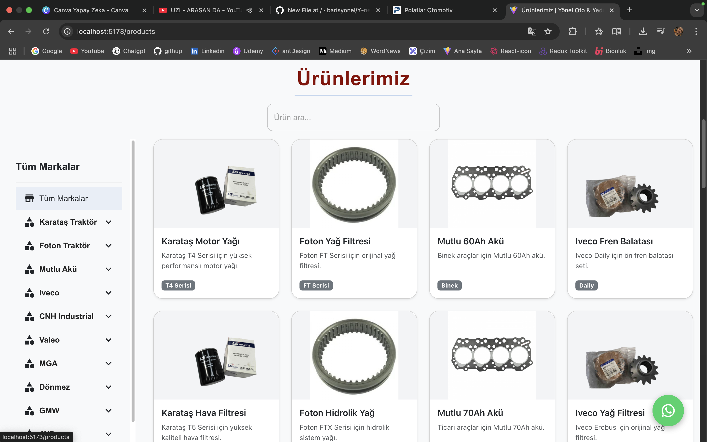

# Yönel Oto - Araç Satış ve Servis Platformu

## Proje Hakkında
Yönel Oto, modern ve kullanıcı dostu bir araç satış ve servis platformudur. React ve Material-UI ile geliştirilmiş frontend, Express.js ve MongoDB backend teknolojileri kullanılarak oluşturulmuştur.

## Özellikler
- Responsive tasarım
- Ürün listeleme ve detaylı görüntüleme
- İletişim formu
- Google Maps entegrasyonu
- Modern UI/UX

## Teknolojiler
### Frontend
- React
- Material-UI
- React Router
- Axios
- React Slick (Carousel)
- Google Maps API

### Backend
- Node.js
- Express.js
- MongoDB
- Mongoose

## Kurulum
1. Frontend klasöründe:
```bash
npm install
npm run dev
```

2. Backend klasöründe:
```bash
npm install
npm start
```

## Ekran Görüntüleri



## Lisans
MIT
